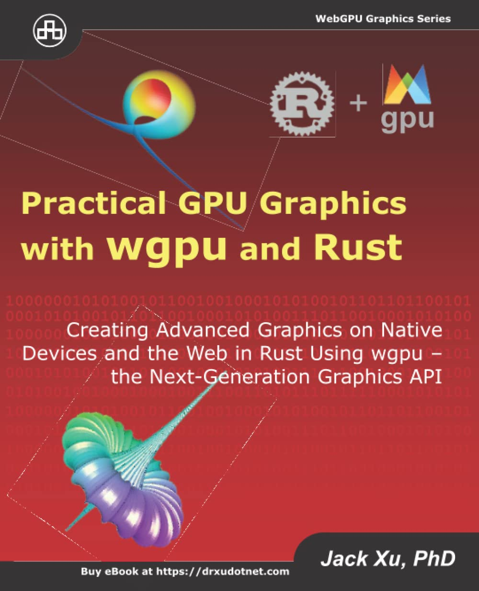

## 🎨 Practical GPU Graphics Hands-on
This is my hands-on application of concepts taught by Dr. Xu from his book, "Practical GPU Graphics with WGPU and Rust." This is a little updated but I thought of reading it for a general better understanding of the subject.

**link:** https://www.goodreads.com/book/show/65147247-practical-gpu-graphics-with-wgpu-and-rust